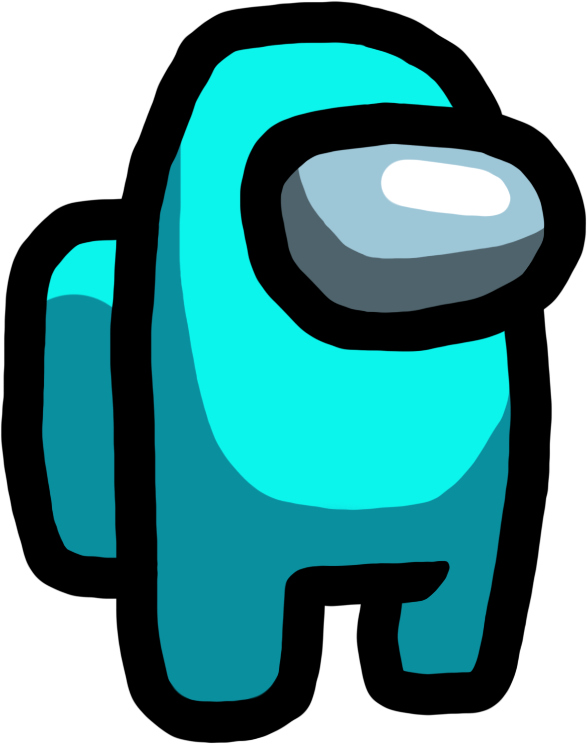

# Maze
***
##### Maze is a python game that player need to collect items in a maze.


### Required libraries
##### In order to run Maze properly, you need to install pygame
1. ```python3 -m pip install -U pygame --user``` to install pygame
2. ```python3 -m pygame.examples.aliens``` to test pygame
##### To test Maze runs properly, you need to install pytest
1. ```pip install -U pytest``` to install pytest
2. ```$pytest --version``` to check pytest version


### Project Structure
The main structures of Maze are based on MVC design pattern.
##### main.py
This is the main which is used to run Maze.
##### web_api.py
This is the application which is used for web api.
##### maze.txt
This the the original maze layout.
##### controllers
This is the controllers folder. This folder contains all control system.

```__init__.py, app.py```
##### models
This is the models folder. This folder contains all the attributes and behaviours.

```__init__.py, maze.py, picture.py, player.py```
##### views
This is the views folder. This folder contains all information user can see.

```__init__.py, maze_view.py```
##### templates
This the the templates folder. This folder contains all html templates. 
##### tests
This is the unittest folder. This folder contains all tests for controllers, models and views.


### Run Maze
1. To run Maze ```python main.py```
2. Enter your name
3. Play


### View player rank
1. run `web_api.py`
2. go to http://localhost:5000


### Play Maze
##### Elements:

**player**



**item**


**exit**


##### Move: 

`w` move up `s` move down `a` move left `d` move right

`i` show backpack

`esc` or `space` to exit Maze

##### Win/Lose condition:

If player collects all items and moves to exit, player wins.

If player haven't collected all items and moves to exit, player lose.


### Unit test
There a list of test files inside `tests` folder. They will run pytest for Maze in different aspects.
1. to test maze:
```pytest test_maze.py```
2. to test player:
```pytest test_player.py```

### Authors
ACIT 2515 2C - Group 5

Oliver Yan, Oliver Si, and Jianfei Liu